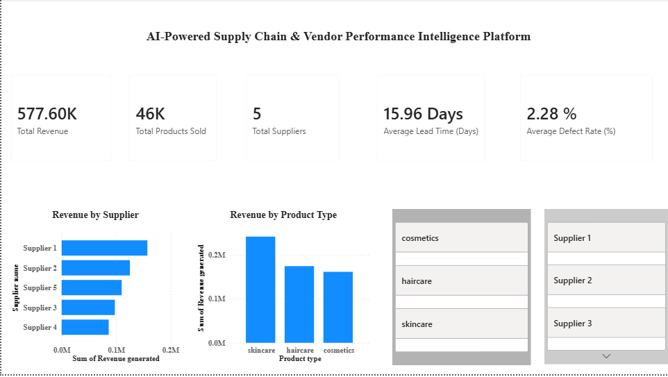
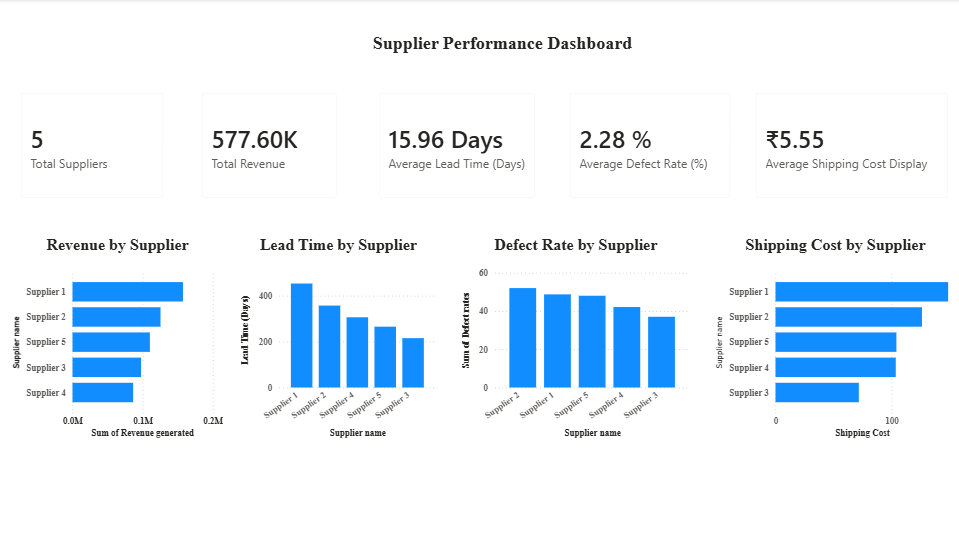
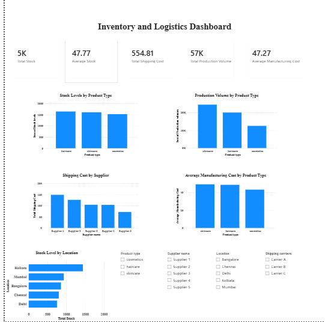

# Inventory & Supply Chain Analytics Dashboard

## Tools & Technologies
- Power BI
- Power Query
- DAX

## Project Description
Built an interactive Power BI dashboard for inventory and supply-chain analysis using DAX KPIs, data transformation, and interactive visualizations.

## Key Analysis
- Inventory and stock level analysis
- Production volume analysis
- Shipping cost analysis
- Manufacturing cost analysis
- Supplier analysis
- Location-wise stock analysis

## Dashboards

### Dashboard 1 – Inventory Analysis

### Dashboard 2 – Supply Chain Analysis

### Dashboard 3 – Location & Product Analysis

